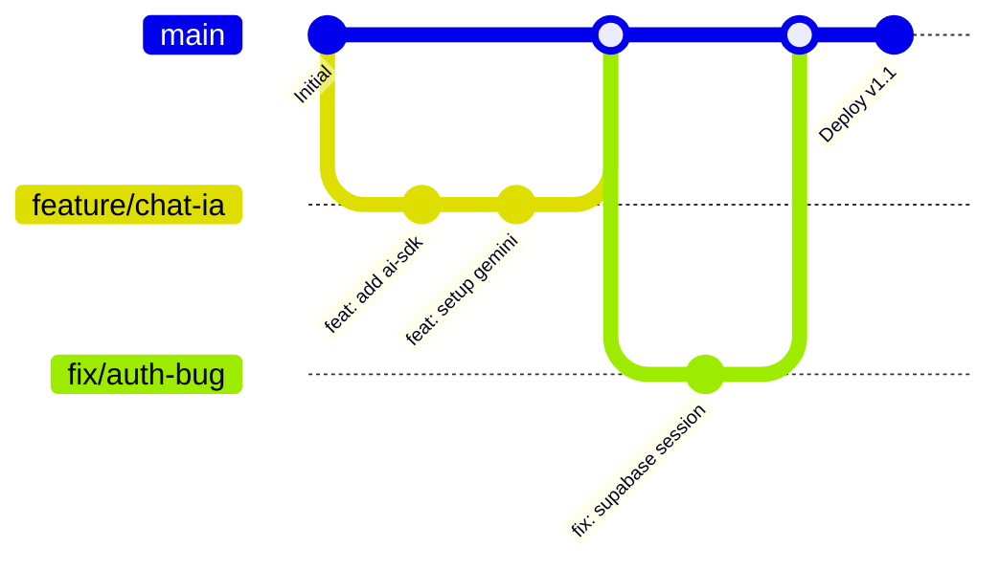

# 🌳 Guia de Contribuição e GitFlow

Seja bem-vindo ao desenvolvimento do **Parque dos Eucaliptos**! Para manter a sanidade do projeto e a velocidade de entrega, seguimos um fluxo de trabalho focado em **Feature Branches** (GitHub Flow).

---

## 🛰️ Fluxo de Trabalho (GitHub Flow)

Trabalhamos com uma branch principal (`main`) que reflete o estado de produção. Todo novo código entra via Pull Request após revisão.

### Passo a Passo para o Desenvolvedor:
1. **Sincronize a `main`:** Garanta que sua base local está atualizada (`git pull origin main`).
2. **Crie sua Branch:** Use nomes descritivos: `feature/nome-da-tarefa` ou `fix/problema-encontrado`.
3. **Desenvolva e Comite:** Siga os [Padrões de Commit](#-padrões-de-commit).
4. **Push e Pull Request:** Suba sua branch e abra um PR no GitHub para revisão.
5. **Merge:** Após aprovado, o código é mesclado na `main` e deletamos a branch temporária.

---

## 📝 Padrões de Commit

Usamos **Conventional Commits** para manter um histórico limpo e facilitar a geração automática de changelogs.

| Prefixo | Descrição | Exemplo |
| :--- | :--- | :--- |
| `feat:` | Nova funcionalidade | `feat: implementação do motor RAG` |
| `fix:` | Correção de bug | `fix: ajuste no padding do chat` |
| `docs:` | Mudanças na documentação | `docs: atualização do readme` |
| `style:` | Formatação, pontos e vírgulas (sem mudança de lógica) | `style: linting no lib/supabase.ts` |
| `refactor:` | Refatoração de código | `refactor: melhoria na função de embedding` |
| `test:` | Adição ou correção de testes | `test: unitário para a busca semântica` |

---

## 🔐 Gerenciamento de Segredos (`.env`)

**NUNCA** comite o arquivo `.env.local`. Ele contém chaves privadas do Supabase e do Google AI Studio. 

- Se você adicionar uma nova chave necessária ao projeto, adicione-a no arquivo `.env.example` (vazio) e avise o time.
- Ao baixar o projeto, execute `cp .env.example .env.local` e preencha com suas credenciais.

---

## 🛠️ Boas Práticas
- **Mantenha os PRs pequenos:** É melhor abrir 3 PRs pequenos do que um gigante de 50 arquivos.
- **Auto-Review:** Antes de pedir revisão, olhe seu próprio código no GitHub para ver se não deixou `console.log` ou comentários desnecessários.
- **Estética Nature-First:** Ao criar novos componentes, siga o design system definido no `PRODUCTOWNER.md`.

---
*Dúvidas? Fale com o @ebertonfranca ou o Guardião da IA!* 🌲🚀
