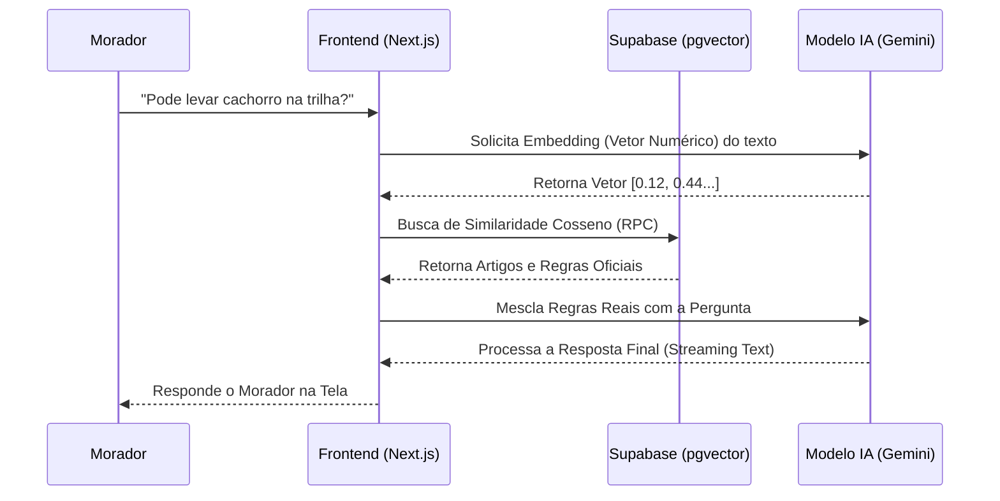

# 🌳 Parque dos Eucaliptos

**Plataforma de Gestão e Comunidade Inteligente** para o conjunto de chácaras Parque dos Eucaliptos.  
Construído com uma arquitetura moderna ("Green Stack") baseada no Next.js, com foco em alta performance, transparência administrativa e inteligência artificial de **Custo Zero** de Infraestrutura..


---

## 🚀 Arquitetura e Fluxo de IA (RAG)

O coração brilhante do nosso ecossistema é o **Zelador Digital**, um agente virtual alimentado pelo Google Gemini e Vector Database. Ele lê as normas e regras do Parque salvos de forma segmentada (`pgvector`) no Supabase. Esse isolamento impede "alucinações" e garante que o Assistente Virtual atue bloqueando conversas aleatórias (Anti-Jailbreak).



---

## 📋 Funcionalidades Principais (Em Desenvolvimento)

- **Central de Transparência:** Feed com histórico, fotos e vídeos reais das melhorias realizadas na área do parque.
- **Área do Morador Privada:** Autenticação (Zero-Passwords) via Supabase Magic Link. Fórum de interação interna para a associação.
- **Chatbot Integrado:** RAG Assitant embutido em um balão dinâmico na aplicação para esclarecimento rápido de minutas.
- **Comunicação Ativa:** Call-to-actions estratégicos no front-end para abrir o WhatsApp Oficial do Síndico mediante necessidade de emergência.

---

## 💻 Instalação Sem Docker (Recomendado para Desenvolvimento local)

Para subir o ambiente via Node localmente com Hot-Reload (Turbopack):

### Pré-requisitos
- **Node.js**: Recomenda-se ambiente V20 ou superior (Utilize o comando padrão via `nvm use 24` se necessário).
- Credenciais dos Serviços Externos (Google AI Studio e Supabase).

### Passo a Passo
1. Clone este repositório para sua máquina.
2. Atualize ou instale os pacotes principais usando o gerenciador de pacotes:
   ```bash
   npm install
   ```
3. Declare as variáveis de autenticação em um arquivo seguro protegido. Renomeie o arquivo ou copie para criar o seu próprio:
   ```bash
   cp .env.example .env.local
   ```
   *(Preencha as chaves dentro do novo `env.local`)*.
4. Rode a iniciativa do Servidor Local via Turbopack:
   ```bash
   npm run dev
   ```
5. Acesse aplicação visual de renderização em servidor no link: http://localhost:3000

---

## 🐳 Instalação Com Docker (Homologação / Produção isolada)

Se decidir contêinerizar a aplicação (Sem instalação manual do NODE local no seu próprio kernel). A versão conteinerizada previne conflitos de libs.

### Pré-requisitos
- Docker Engine ativo na sua máquina (`Docker Desktop` ou `WSL dockerd`).
- `docker-compose` ativado.

### Passo a Passo
1. Certifique-se de preencher adequadamente as senhas dentro do arquivo de ambiente base `.env.local`.
2. Efetue o build silencioso e inicialize o Container via daemon layer:
   ```bash
   docker compose up -d --build
   ```
3. Acompanhe se o Next.JS Build foi executado dentro da imagem visualizando os logs do host:
   ```bash
   docker compose logs -f
   ```
4. Navegue à web http://localhost:3000 para conferir no ar.
   *(Para desativar a máquina isolada, apenas rode `docker compose down`)*.

---

## 🔒 Setup de Ambiente de Rotinas (`.env.local`)

```env
# Conexões Livres do Supabase (Database + Auth Cloud)
NEXT_PUBLIC_SUPABASE_URL=
NEXT_PUBLIC_SUPABASE_ANON_KEY=

# Autenticação Google para a IA Generativa do Chat RAG (Vercel SDK)
GOOGLE_GENERATIVE_AI_API_KEY=
```
